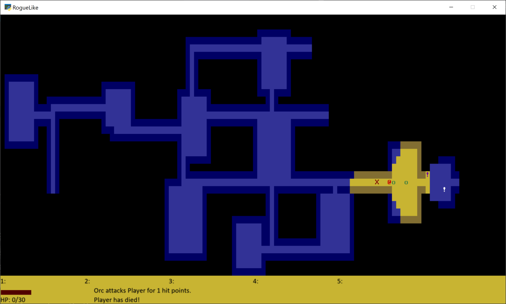

Python Arcade Library Rogue-Like
================================

This is a `rogue-like`_ adventure written in the `Python computer language`_
using the `Arcade Library`_.

.. _rogue-like: https://en.wikipedia.org/wiki/Roguelike
.. _Python computer language: https://www.python.org/
.. _Arcade Library: https://arcade.academy

Use this code to hack away at creating your own adventure game!

.. toctree::

    install
    how_to_play
    features
    code_docs

Other links:

* `Source on GitHub <https://github.com/pythonarcade/roguelike>`_
* `Arcade Library`_
* `License (MIT) <https://github.com/pythonarcade/roguelike/blob/master/license.rst>`_

